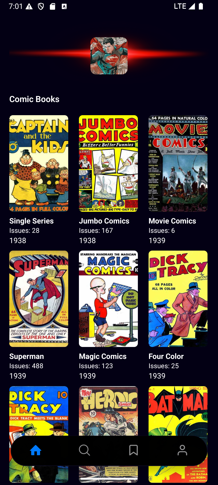

## COMIC PARADISE - MOBILE APP
A mobile comic book browsing app built with React Native. It uses the Comic Vine API to fetch and display comic book data. Users can browse through comics and view detailed information about each one.

### Features
- Browse a feed of comic books

- Fetches real comic data from the Comic Vine API

- View detailed pages for each comic

- Smooth navigation using tabs and stacks

- Designed for mobile-first experience

### Tech Stack
* React Native
* Expo
* TypeScript
* Native Wind
* Comic Vine API

## Setup Instructions
1. git clone https://github.com/SimonDdungu/comic-paradise.git
2. cd comic-paradise
3. npm install
4. npx expo start --clear
5. Download Expo go app [ [Android](https://play.google.com/store/apps/details?id=host.exp.exponent&referrer=www) | [IOS](https://apps.apple.com/us/app/expo-go/id982107779) ] onto your phone and scan the QR code provided in your Terminal. Ensure that your PC and Phone are connected and using the same Wi-fi network.  
   OR Use a virtual emulator (Android emulator from Android studio / IOS emulator from Xcode [Requires a MacBook]) -- in your terminal, press "a" for Android or press "i" for IOS to lauch the app from the emulator

### Prerequisite:
To use the Comic Vine API, you will need your own API Key, please sign up to get an api key here: [**Get Comic Vine API Key**](https://comicvine.gamespot.com/api/)

Create a **.env** file at the root of the application and set the following:

- EXPO_PUBLIC_COMIC_VINE_URL=https://comicvine.gamespot.com/api
- EXPO_PUBLIC_COMIC_VINE_KEY= [Your Api Key](https://comicvine.gamespot.com/api/)

### App icon 

### Screenshots

NOTE: *The app is still being maintained and updated to improve performance and optimization*

This application was built by me to showcase my skills and add to my portfolio, not for commercial purposes. 
[My Portfolio](https://portfolio-v2-0-six.vercel.app/)

